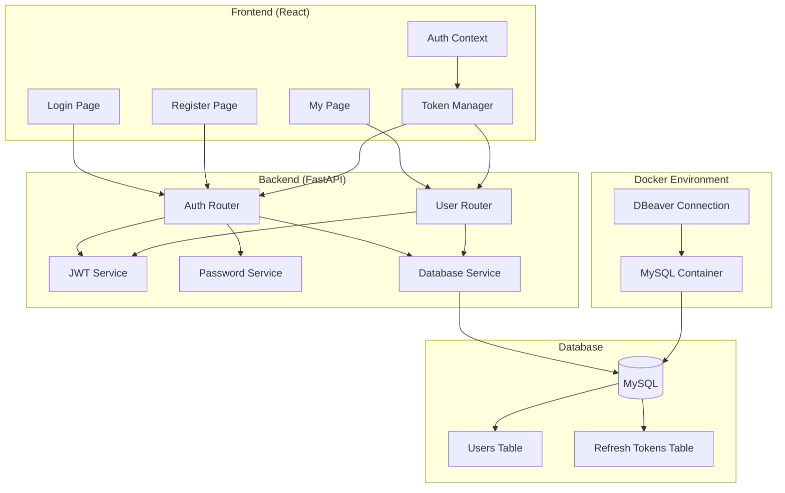
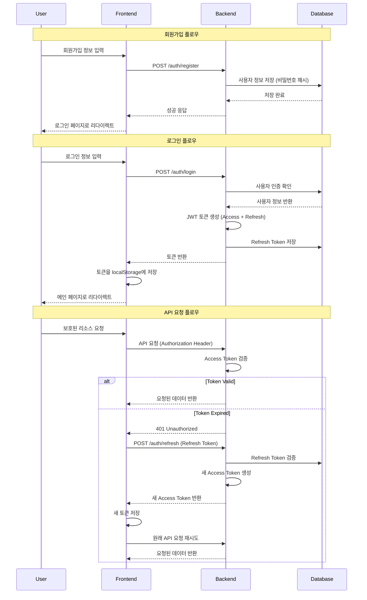

# 사용자 인증 시스템 설계 문서

## 개요

해양레저 추천 플랫폼에 JWT 기반 사용자 인증 시스템을 구현합니다. 이 시스템은 FastAPI 백엔드와 React 프론트엔드, MySQL 데이터베이스를 사용하여 안전하고 확장 가능한 인증 솔루션을 제공합니다.

## 아키텍처

### 전체 시스템 아키텍처



### 인증 플로우



## 컴포넌트 및 인터페이스

### 백엔드 컴포넌트

#### 1. 데이터베이스 스키마

```sql
-- Users 테이블
CREATE TABLE users (
    id INT PRIMARY KEY AUTO_INCREMENT,
    email VARCHAR(255) UNIQUE NOT NULL,
    name VARCHAR(100) NOT NULL,
    password_hash VARCHAR(255) NOT NULL,
    is_active BOOLEAN DEFAULT TRUE,
    failed_login_attempts INT DEFAULT 0,
    locked_until DATETIME NULL,
    created_at DATETIME DEFAULT CURRENT_TIMESTAMP,
    updated_at DATETIME DEFAULT CURRENT_TIMESTAMP ON UPDATE CURRENT_TIMESTAMP
);

-- Refresh Tokens 테이블
CREATE TABLE refresh_tokens (
    id INT PRIMARY KEY AUTO_INCREMENT,
    user_id INT NOT NULL,
    token_hash VARCHAR(255) NOT NULL,
    expires_at DATETIME NOT NULL,
    created_at DATETIME DEFAULT CURRENT_TIMESTAMP,
    FOREIGN KEY (user_id) REFERENCES users(id) ON DELETE CASCADE,
    INDEX idx_user_id (user_id),
    INDEX idx_expires_at (expires_at)
);
```

#### 2. Pydantic 모델

```python
# schemas/auth.py
from pydantic import BaseModel, EmailStr
from datetime import datetime
from typing import Optional

class UserRegister(BaseModel):
    email: EmailStr
    name: str
    password: str
    password_confirm: str

class UserLogin(BaseModel):
    email: EmailStr
    password: str

class UserResponse(BaseModel):
    id: int
    email: str
    name: str
    created_at: datetime
    is_active: bool

class TokenResponse(BaseModel):
    access_token: str
    refresh_token: str
    token_type: str = "bearer"
    expires_in: int

class TokenRefresh(BaseModel):
    refresh_token: str

class UserUpdate(BaseModel):
    name: Optional[str] = None

class PasswordChange(BaseModel):
    current_password: str
    new_password: str
    new_password_confirm: str
```

#### 3. JWT 서비스

```python
# services/jwt_service.py
import jwt
from datetime import datetime, timedelta
from typing import Optional, Dict, Any
from fastapi import HTTPException, status

class JWTService:
    def __init__(self, secret_key: str, algorithm: str = "HS256"):
        self.secret_key = secret_key
        self.algorithm = algorithm
        self.access_token_expire_minutes = 15
        self.refresh_token_expire_days = 7
    
    def create_access_token(self, data: Dict[str, Any]) -> str:
        to_encode = data.copy()
        expire = datetime.utcnow() + timedelta(minutes=self.access_token_expire_minutes)
        to_encode.update({"exp": expire, "type": "access"})
        return jwt.encode(to_encode, self.secret_key, algorithm=self.algorithm)
    
    def create_refresh_token(self, data: Dict[str, Any]) -> str:
        to_encode = data.copy()
        expire = datetime.utcnow() + timedelta(days=self.refresh_token_expire_days)
        to_encode.update({"exp": expire, "type": "refresh"})
        return jwt.encode(to_encode, self.secret_key, algorithm=self.algorithm)
    
    def verify_token(self, token: str, token_type: str = "access") -> Dict[str, Any]:
        try:
            payload = jwt.decode(token, self.secret_key, algorithms=[self.algorithm])
            if payload.get("type") != token_type:
                raise HTTPException(
                    status_code=status.HTTP_401_UNAUTHORIZED,
                    detail="Invalid token type"
                )
            return payload
        except jwt.ExpiredSignatureError:
            raise HTTPException(
                status_code=status.HTTP_401_UNAUTHORIZED,
                detail="Token has expired"
            )
        except jwt.JWTError:
            raise HTTPException(
                status_code=status.HTTP_401_UNAUTHORIZED,
                detail="Invalid token"
            )
```

#### 4. 비밀번호 서비스

```python
# services/password_service.py
import bcrypt
from typing import str

class PasswordService:
    @staticmethod
    def hash_password(password: str) -> str:
        salt = bcrypt.gensalt()
        return bcrypt.hashpw(password.encode('utf-8'), salt).decode('utf-8')
    
    @staticmethod
    def verify_password(password: str, hashed_password: str) -> bool:
        return bcrypt.checkpw(
            password.encode('utf-8'), 
            hashed_password.encode('utf-8')
        )
```

#### 5. 데이터베이스 서비스

```python
# services/database_service.py
import aiomysql
from typing import Optional, Dict, Any, List
from datetime import datetime, timedelta

class DatabaseService:
    def __init__(self, connection_pool):
        self.pool = connection_pool
    
    async def create_user(self, email: str, name: str, password_hash: str) -> int:
        async with self.pool.acquire() as conn:
            async with conn.cursor() as cursor:
                await cursor.execute(
                    "INSERT INTO users (email, name, password_hash) VALUES (%s, %s, %s)",
                    (email, name, password_hash)
                )
                await conn.commit()
                return cursor.lastrowid
    
    async def get_user_by_email(self, email: str) -> Optional[Dict[str, Any]]:
        async with self.pool.acquire() as conn:
            async with conn.cursor(aiomysql.DictCursor) as cursor:
                await cursor.execute(
                    "SELECT * FROM users WHERE email = %s AND is_active = TRUE",
                    (email,)
                )
                return await cursor.fetchone()
    
    async def get_user_by_id(self, user_id: int) -> Optional[Dict[str, Any]]:
        async with self.pool.acquire() as conn:
            async with conn.cursor(aiomysql.DictCursor) as cursor:
                await cursor.execute(
                    "SELECT * FROM users WHERE id = %s AND is_active = TRUE",
                    (user_id,)
                )
                return await cursor.fetchone()
    
    async def store_refresh_token(self, user_id: int, token_hash: str, expires_at: datetime):
        async with self.pool.acquire() as conn:
            async with conn.cursor() as cursor:
                await cursor.execute(
                    "INSERT INTO refresh_tokens (user_id, token_hash, expires_at) VALUES (%s, %s, %s)",
                    (user_id, token_hash, expires_at)
                )
                await conn.commit()
    
    async def verify_refresh_token(self, token_hash: str) -> Optional[Dict[str, Any]]:
        async with self.pool.acquire() as conn:
            async with conn.cursor(aiomysql.DictCursor) as cursor:
                await cursor.execute(
                    """SELECT rt.*, u.* FROM refresh_tokens rt 
                       JOIN users u ON rt.user_id = u.id 
                       WHERE rt.token_hash = %s AND rt.expires_at > NOW() AND u.is_active = TRUE""",
                    (token_hash,)
                )
                return await cursor.fetchone()
    
    async def delete_refresh_token(self, token_hash: str):
        async with self.pool.acquire() as conn:
            async with conn.cursor() as cursor:
                await cursor.execute(
                    "DELETE FROM refresh_tokens WHERE token_hash = %s",
                    (token_hash,)
                )
                await conn.commit()
```

### 프론트엔드 컴포넌트

#### 1. 인증 컨텍스트

```javascript
// contexts/AuthContext.jsx
import React, { createContext, useContext, useState, useEffect } from 'react';
import { authAPI } from '../api/auth';

const AuthContext = createContext();

export const useAuth = () => {
    const context = useContext(AuthContext);
    if (!context) {
        throw new Error('useAuth must be used within an AuthProvider');
    }
    return context;
};

export const AuthProvider = ({ children }) => {
    const [user, setUser] = useState(null);
    const [loading, setLoading] = useState(true);
    const [tokens, setTokens] = useState({
        accessToken: localStorage.getItem('accessToken'),
        refreshToken: localStorage.getItem('refreshToken')
    });

    // 토큰 자동 갱신 로직
    useEffect(() => {
        const refreshInterval = setInterval(() => {
            if (tokens.accessToken) {
                refreshTokenIfNeeded();
            }
        }, 5 * 60 * 1000); // 5분마다 체크

        return () => clearInterval(refreshInterval);
    }, [tokens.accessToken]);

    const login = async (email, password) => {
        try {
            const response = await authAPI.login(email, password);
            const { access_token, refresh_token, user: userData } = response.data;
            
            setTokens({ accessToken: access_token, refreshToken: refresh_token });
            setUser(userData);
            
            localStorage.setItem('accessToken', access_token);
            localStorage.setItem('refreshToken', refresh_token);
            
            return { success: true };
        } catch (error) {
            return { success: false, error: error.response?.data?.detail || 'Login failed' };
        }
    };

    const logout = async () => {
        try {
            if (tokens.refreshToken) {
                await authAPI.logout(tokens.refreshToken);
            }
        } catch (error) {
            console.error('Logout error:', error);
        } finally {
            setUser(null);
            setTokens({ accessToken: null, refreshToken: null });
            localStorage.removeItem('accessToken');
            localStorage.removeItem('refreshToken');
        }
    };

    const refreshTokenIfNeeded = async () => {
        if (!tokens.refreshToken) return false;
        
        try {
            const response = await authAPI.refreshToken(tokens.refreshToken);
            const { access_token } = response.data;
            
            setTokens(prev => ({ ...prev, accessToken: access_token }));
            localStorage.setItem('accessToken', access_token);
            
            return true;
        } catch (error) {
            console.error('Token refresh failed:', error);
            logout();
            return false;
        }
    };

    const value = {
        user,
        tokens,
        login,
        logout,
        refreshTokenIfNeeded,
        loading
    };

    return (
        <AuthContext.Provider value={value}>
            {children}
        </AuthContext.Provider>
    );
};
```

#### 2. API 인터셉터

```javascript
// api/client.js (기존 파일 확장)
import axios from 'axios';

const API_BASE_URL = import.meta.env.VITE_BACKEND_URL || 'http://localhost:8000';

const apiClient = axios.create({
    baseURL: API_BASE_URL,
    headers: {
        'Content-Type': 'application/json',
    },
});

// 요청 인터셉터 - 토큰 자동 추가
apiClient.interceptors.request.use(
    (config) => {
        const token = localStorage.getItem('accessToken');
        if (token) {
            config.headers.Authorization = `Bearer ${token}`;
        }
        return config;
    },
    (error) => Promise.reject(error)
);

// 응답 인터셉터 - 401 오류 시 토큰 갱신 시도
apiClient.interceptors.response.use(
    (response) => response,
    async (error) => {
        const originalRequest = error.config;
        
        if (error.response?.status === 401 && !originalRequest._retry) {
            originalRequest._retry = true;
            
            const refreshToken = localStorage.getItem('refreshToken');
            if (refreshToken) {
                try {
                    const response = await axios.post(`${API_BASE_URL}/auth/refresh`, {
                        refresh_token: refreshToken
                    });
                    
                    const { access_token } = response.data;
                    localStorage.setItem('accessToken', access_token);
                    
                    // 원래 요청 재시도
                    originalRequest.headers.Authorization = `Bearer ${access_token}`;
                    return apiClient(originalRequest);
                } catch (refreshError) {
                    // 토큰 갱신 실패 시 로그아웃
                    localStorage.removeItem('accessToken');
                    localStorage.removeItem('refreshToken');
                    window.location.href = '/login';
                }
            } else {
                window.location.href = '/login';
            }
        }
        
        return Promise.reject(error);
    }
);

export default apiClient;
```

## 데이터 모델

### 사용자 데이터 모델

```typescript
interface User {
    id: number;
    email: string;
    name: string;
    created_at: string;
    is_active: boolean;
}

interface AuthTokens {
    access_token: string;
    refresh_token: string;
    token_type: string;
    expires_in: number;
}

interface LoginCredentials {
    email: string;
    password: string;
}

interface RegisterData {
    email: string;
    name: string;
    password: string;
    password_confirm: string;
}
```

## 에러 처리

### 백엔드 에러 처리

```python
# exceptions/auth_exceptions.py
from fastapi import HTTPException, status

class AuthException(HTTPException):
    def __init__(self, detail: str):
        super().__init__(status_code=status.HTTP_401_UNAUTHORIZED, detail=detail)

class UserNotFoundException(HTTPException):
    def __init__(self):
        super().__init__(status_code=status.HTTP_404_NOT_FOUND, detail="User not found")

class EmailAlreadyExistsException(HTTPException):
    def __init__(self):
        super().__init__(status_code=status.HTTP_400_BAD_REQUEST, detail="Email already registered")

class InvalidCredentialsException(AuthException):
    def __init__(self):
        super().__init__("Invalid email or password")

class TokenExpiredException(AuthException):
    def __init__(self):
        super().__init__("Token has expired")

class AccountLockedException(HTTPException):
    def __init__(self, unlock_time: str):
        super().__init__(
            status_code=status.HTTP_423_LOCKED,
            detail=f"Account is locked until {unlock_time}"
        )
```

### 프론트엔드 에러 처리

```javascript
// utils/errorHandler.js
export const handleAuthError = (error) => {
    if (error.response) {
        const { status, data } = error.response;
        
        switch (status) {
            case 400:
                return data.detail || 'Invalid request';
            case 401:
                return 'Invalid credentials';
            case 423:
                return data.detail || 'Account is locked';
            case 500:
                return 'Server error. Please try again later.';
            default:
                return 'An unexpected error occurred';
        }
    }
    
    return 'Network error. Please check your connection.';
};
```

## 테스팅 전략

### 백엔드 테스트

```python
# tests/test_auth.py
import pytest
from fastapi.testclient import TestClient
from app.main import app

client = TestClient(app)

class TestAuth:
    def test_register_success(self):
        response = client.post("/auth/register", json={
            "email": "test@example.com",
            "name": "Test User",
            "password": "password123",
            "password_confirm": "password123"
        })
        assert response.status_code == 201
        assert "id" in response.json()
    
    def test_register_duplicate_email(self):
        # 첫 번째 등록
        client.post("/auth/register", json={
            "email": "test@example.com",
            "name": "Test User",
            "password": "password123",
            "password_confirm": "password123"
        })
        
        # 중복 이메일로 등록 시도
        response = client.post("/auth/register", json={
            "email": "test@example.com",
            "name": "Another User",
            "password": "password456",
            "password_confirm": "password456"
        })
        assert response.status_code == 400
        assert "already registered" in response.json()["detail"]
    
    def test_login_success(self):
        # 사용자 등록
        client.post("/auth/register", json={
            "email": "login@example.com",
            "name": "Login User",
            "password": "password123",
            "password_confirm": "password123"
        })
        
        # 로그인
        response = client.post("/auth/login", json={
            "email": "login@example.com",
            "password": "password123"
        })
        assert response.status_code == 200
        data = response.json()
        assert "access_token" in data
        assert "refresh_token" in data
        assert data["token_type"] == "bearer"
    
    def test_protected_route_with_valid_token(self):
        # 로그인하여 토큰 획득
        login_response = client.post("/auth/login", json={
            "email": "login@example.com",
            "password": "password123"
        })
        token = login_response.json()["access_token"]
        
        # 보호된 라우트 접근
        response = client.get("/users/me", headers={
            "Authorization": f"Bearer {token}"
        })
        assert response.status_code == 200
        assert "email" in response.json()
    
    def test_token_refresh(self):
        # 로그인하여 토큰 획득
        login_response = client.post("/auth/login", json={
            "email": "login@example.com",
            "password": "password123"
        })
        refresh_token = login_response.json()["refresh_token"]
        
        # 토큰 갱신
        response = client.post("/auth/refresh", json={
            "refresh_token": refresh_token
        })
        assert response.status_code == 200
        assert "access_token" in response.json()
```

### 프론트엔드 테스트

```javascript
// tests/auth.test.jsx
import { render, screen, fireEvent, waitFor } from '@testing-library/react';
import { AuthProvider } from '../contexts/AuthContext';
import LoginPage from '../components/LoginPage';

describe('Authentication', () => {
    test('successful login redirects to dashboard', async () => {
        render(
            <AuthProvider>
                <LoginPage />
            </AuthProvider>
        );
        
        fireEvent.change(screen.getByLabelText(/email/i), {
            target: { value: 'test@example.com' }
        });
        fireEvent.change(screen.getByLabelText(/password/i), {
            target: { value: 'password123' }
        });
        
        fireEvent.click(screen.getByRole('button', { name: /login/i }));
        
        await waitFor(() => {
            expect(window.location.pathname).toBe('/');
        });
    });
    
    test('invalid credentials show error message', async () => {
        render(
            <AuthProvider>
                <LoginPage />
            </AuthProvider>
        );
        
        fireEvent.change(screen.getByLabelText(/email/i), {
            target: { value: 'wrong@example.com' }
        });
        fireEvent.change(screen.getByLabelText(/password/i), {
            target: { value: 'wrongpassword' }
        });
        
        fireEvent.click(screen.getByRole('button', { name: /login/i }));
        
        await waitFor(() => {
            expect(screen.getByText(/invalid credentials/i)).toBeInTheDocument();
        });
    });
});
```

## 보안 고려사항

### 1. 토큰 보안
- JWT 비밀키는 환경변수로 관리
- Access Token은 짧은 만료시간 (15분)
- Refresh Token은 데이터베이스에 해시화하여 저장
- 토큰 재사용 방지를 위한 JTI (JWT ID) 구현

### 2. 비밀번호 보안
- bcrypt를 사용한 해시화 (최소 12 rounds)
- 비밀번호 복잡성 검증
- 연속 로그인 실패 시 계정 잠금

### 3. API 보안
- CORS 정책 적용
- Rate Limiting 구현
- SQL 인젝션 방지를 위한 파라미터화된 쿼리
- 민감한 정보 로깅 방지

### 4. 프론트엔드 보안
- XSS 방지를 위한 입력 검증
- CSRF 토큰 구현 (필요시)
- 토큰을 localStorage 대신 httpOnly 쿠키 사용 고려

## 성능 최적화

### 1. 데이터베이스 최적화
- 인덱스 최적화 (email, user_id, expires_at)
- 만료된 토큰 자동 정리 (cron job)
- 커넥션 풀 사용

### 2. 캐싱 전략
- Redis를 사용한 세션 캐싱 (선택사항)
- JWT 토큰 블랙리스트 캐싱

### 3. 프론트엔드 최적화
- 토큰 갱신 시 중복 요청 방지
- 컴포넌트 lazy loading
- 메모이제이션을 통한 불필요한 리렌더링 방지