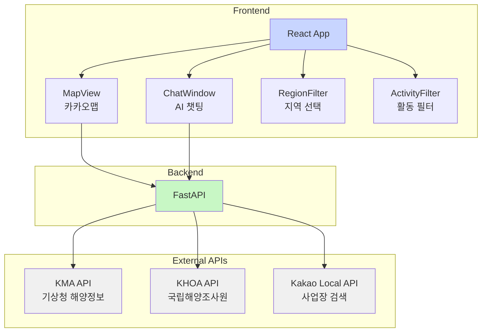
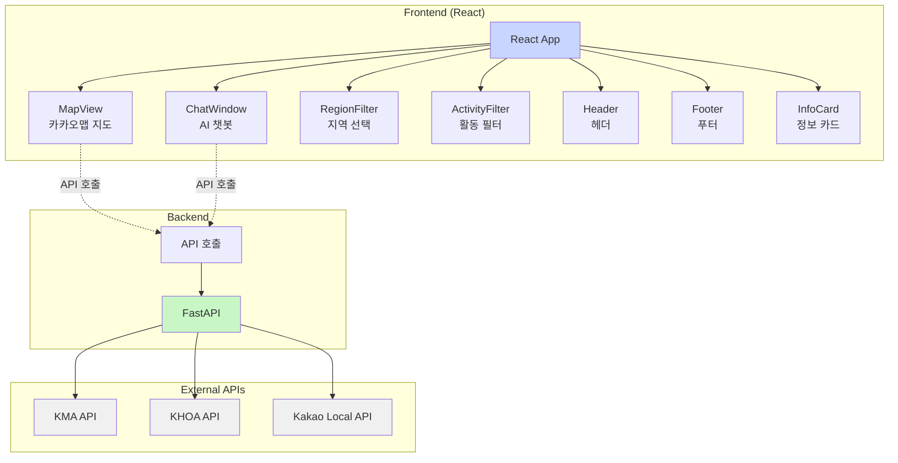
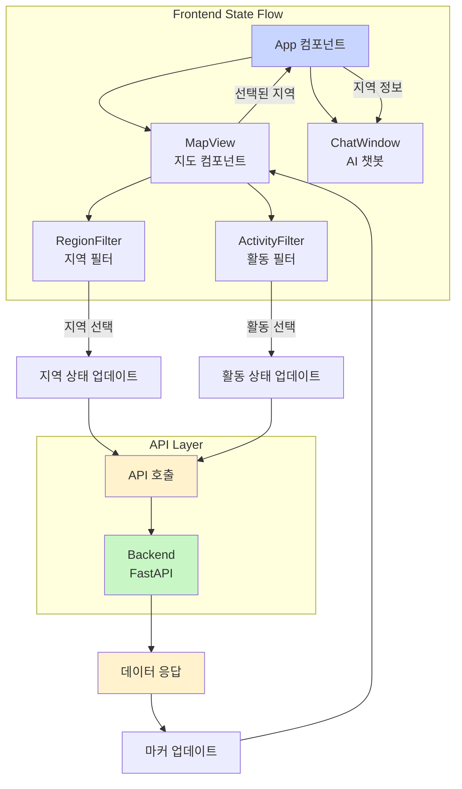
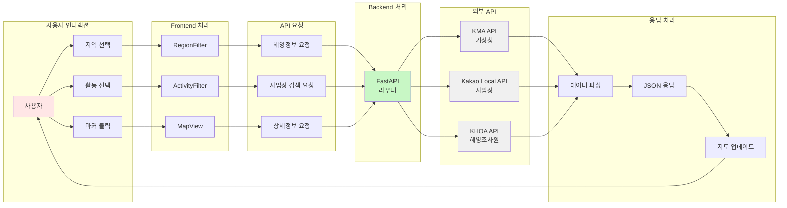
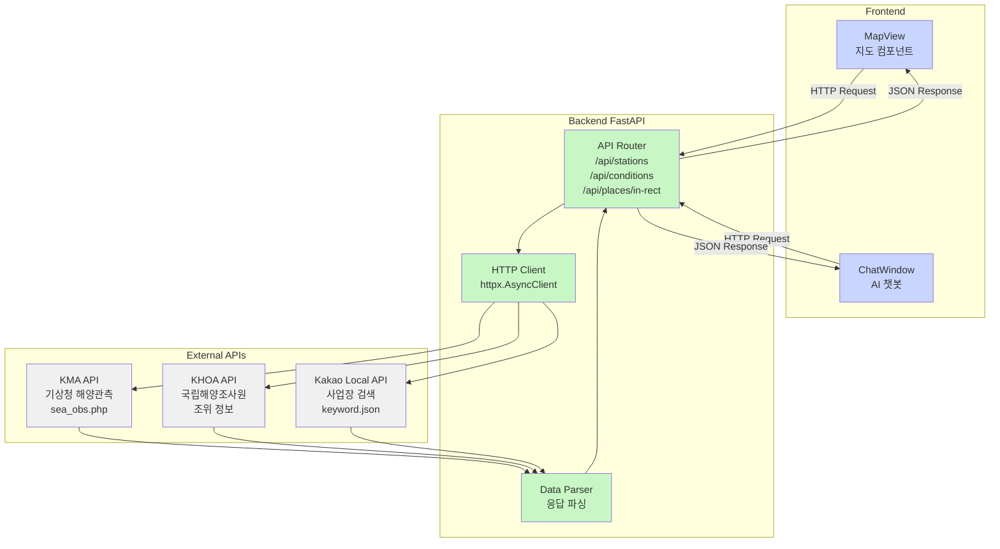
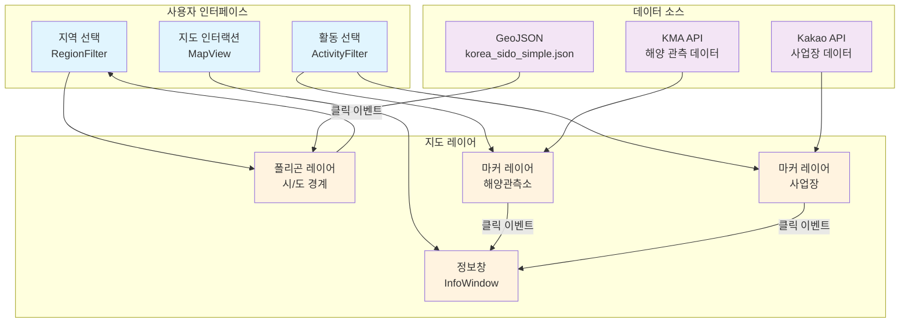
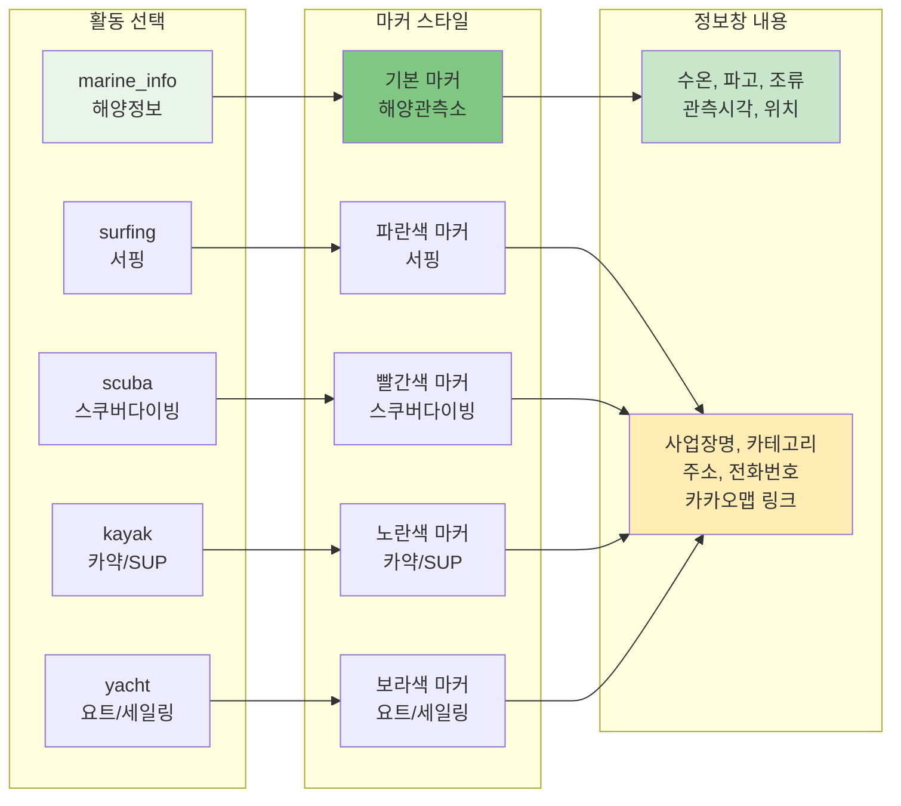

# 🌊 해양레저 추천 플랫폼 기술 설계도

## 📋 프로젝트 개요

### 프로젝트명
Water Sports Recommendation Platform (해양레저 추천 플랫폼)

### 목적
- 실시간 해양 정보(수온, 파고, 조류)를 기반으로 한 해양레저 활동 추천
- 지역별 해양레저 사업장 검색 및 표시
- AI 챗봇을 통한 맞춤형 레저 추천 서비스

### 주요 기능
- 🗺️ 카카오맵 기반 인터랙티브 지도
- 🌊 실시간 해양 정보 표시 (수온, 파고, 조류)
- 🏄 지역별 해양레저 사업장 검색 및 표시
- 🎯 활동별 필터링 (스쿠버다이빙, 카약, 요트 등)
- 💬 AI 챗봇 인터페이스
- 📍 시/도 단위 지역 선택 및 애니메이션
- 📍 활동별 색상 구분 마커 표시

---

## 🏗️ 시스템 아키텍처

### 전체 구조도



### 상세 컴포넌트 구조도



### 기술 스택

#### Frontend
- **Framework**: React 18.3.1
- **Build Tool**: Vite 5.4.1
- **HTTP Client**: Axios 1.11.0
- **Map API**: 카카오맵 JavaScript API

#### Backend
- **Framework**: FastAPI 0.111.0
- **Web Server**: Uvicorn 0.30.1
- **HTTP Client**: httpx 0.27.0
- **Data Validation**: Pydantic 2.8.2
- **Environment**: python-dotenv 1.0.1

#### External APIs
- **기상청 해양관측 API**: 실시간 해양 정보
- **카카오 로컬 API**: 사업장 검색
- **국립해양조사원 API**: 조위/해양 정보

---

## 📁 프로젝트 구조

### 디렉토리 구조
```
water-sports-reco/
├── backend/                          # 백엔드 서버
│   ├── app/
│   │   ├── main.py                   # FastAPI 메인 애플리케이션
│   │   ├── config.py                 # 환경 설정 관리
│   │   ├── schemas.py                # Pydantic 데이터 모델
│   │   ├── deps.py                   # 의존성 주입
│   │   └── services/                 # 외부 API 클라이언트
│   │       ├── kma_client.py         # 기상청 API 클라이언트
│   │       ├── khoa_client.py        # 국립해양조사원 API 클라이언트
│   │       └── kakao_local_client.py # 카카오 로컬 API 클라이언트
│   ├── requirements.txt              # Python 의존성
│   └── .env                         # 환경 변수 (수동 생성 필요)
├── frontend/                         # 프론트엔드 애플리케이션
│   ├── src/
│   │   ├── App.jsx                   # 메인 React 컴포넌트
│   │   ├── main.jsx                  # React 앱 진입점
│   │   ├── api/
│   │   │   └── client.js             # Axios HTTP 클라이언트
│   │   ├── components/               # React 컴포넌트들
│   │   │   ├── MapView.jsx           # 카카오맵 지도 컴포넌트
│   │   │   ├── ChatWindow.jsx        # AI 챗봇 인터페이스
│   │   │   ├── RegionFilter.jsx      # 지역 선택 필터
│   │   │   ├── ActivityFilter.jsx    # 활동 선택 필터
│   │   │   ├── Header.jsx            # 헤더 컴포넌트
│   │   │   ├── Footer.jsx            # 푸터 컴포넌트
│   │   │   └── InfoCard.jsx          # 정보 카드 컴포넌트
│   │   └── hooks/
│   │       └── useKakaoLoader.js     # 카카오맵 API 로드 훅
│   ├── public/
│   │   └── geo/
│   │       └── korea_sido_simple.json # 시/도 경계 GeoJSON 데이터
│   ├── package.json                  # Node.js 의존성
│   └── .env                         # 환경 변수 (수동 생성 필요)
└── README.md                         # 프로젝트 설명서
```

---

## 🔧 핵심 컴포넌트 설계

### Backend 아키텍처

#### 1. API 엔드포인트 구조
```python
# main.py - API 라우터 정의
@app.get("/api/stations")           # 모든 해양 관측소 데이터
@app.get("/api/conditions")         # 특정 지점 해양 조건
@app.get("/api/places/in-rect")     # 영역 내 해양레저 사업장 검색
```

#### 2. 데이터 모델 (Pydantic Schemas)
```python
# schemas.py
class ConditionResponse(BaseModel):
    spotName: str
    lat: float
    lon: float
    sst: Optional[float]           # 해수면 온도
    wave_height: Optional[float]   # 유의파고
    current_speed: Optional[float] # 조류속도
    observed_at: Optional[str]     # 관측시각
    source: str = "KMA"

class PlaceResponse(BaseModel):
    id: str
    name: str
    activity: str                  # 활동 분류
    category: str
    phone: str
    address: str
    road_address: str
    x: float                       # 경도
    y: float                       # 위도
    place_url: str
    distance: str
    source: str
```

#### 3. 외부 API 클라이언트 설계

##### 기상청 해양관측 API (KMA)
```python
# kma_client.py
async def fetch_all_stations()      # 전체 관측소 데이터
async def fetch_station_by_id()     # 특정 관측소 데이터
def _parse_sea_obs_all()           # CSV 응답 파싱
```

##### 카카오 로컬 API
```python
# kakao_local_client.py
class KakaoLocalClient:
    async def search_places_in_rect()    # 영역 내 장소 검색
    async def _search_by_keyword()       # 키워드 기반 검색
    
# 활동별 검색 키워드 매핑
ACTIVITY_KEYWORDS = {
    "surfing": ["서핑", "서핑샵", "서핑스쿨"],
    "scuba": ["스쿠버다이빙", "다이빙 센터"],
    "kayak": ["카약", "카누", "SUP"],
    "yacht": ["요트 투어", "세일링 스쿨"],
    # ... 기타 활동들
}
```

### Frontend 아키텍처

#### 1. 주요 React 컴포넌트

##### MapView 컴포넌트
```jsx
// MapView.jsx - 핵심 지도 컴포넌트
const MapView = ({ onRegionSelect }) => {
    // 상태 관리
    const [stations, setStations] = useState([]);      // 해양 관측소
    const [places, setPlaces] = useState([]);          // 사업장 데이터
    const [selectedRegion, setSelectedRegion] = useState(null);
    const [selectedActivity, setSelectedActivity] = useState("marine_info");
    
    // 핵심 기능
    const fetchStations = async () => { /* 해양정보 로드 */ };
    const fetchPlaces = async (activity) => { /* 사업장 정보 로드 */ };
    const handleRegionSelect = (regionName) => { /* 지역 선택 처리 */ };
    const handleActivitySelect = (activity) => { /* 활동 선택 처리 */ };
};
```

##### 카카오맵 API 훅
```javascript
// useKakaoLoader.js - 카카오맵 API 로드 관리
const useKakaoLoader = (appKey) => {
    const [loaded, setLoaded] = useState(false);
    const [error, setError] = useState(null);
    
    useEffect(() => {
        // 동적 스크립트 로드 및 에러 처리
        const script = document.createElement('script');
        script.src = `//dapi.kakao.com/v2/maps/sdk.js?appkey=${appKey}&libraries=services`;
        // 로드 완료/실패 처리
    }, [appKey]);
    
    return { loaded, error };
};
```

#### 2. 상태 관리 흐름



### 데이터 흐름 다이어그램



---

## 🔗 API 연동 설계

### API 연동 아키텍처



### 1. 기상청 해양관측 API

#### 요청 구조
```http
GET https://apihub.kma.go.kr/api/typ01/url/sea_obs.php
Parameters:
- stn: 관측소 ID (0 = 전체)
- authKey: API 인증키
- tm: 관측시각 (선택사항)
```

#### 응답 파싱
```python
# CSV 형태 응답을 파싱하여 JSON으로 변환
def _parse_sea_obs_all(text: str) -> List[Dict[str, Any]]:
    # TP, TM, STN_ID, STN_KO, LON, LAT, WH, WD, WS, WS_GST, TW, TA, PA, HM
    # 각 필드를 적절한 타입으로 변환하여 반환
```

### 2. 카카오 로컬 API

#### 검색 전략
```python
# 활동별 키워드 매핑을 통한 다중 검색
for activity in activities:
    keywords = ACTIVITY_KEYWORDS[activity]
    for keyword in keywords:
        # 페이지네이션을 통한 전체 결과 수집
        for page in range(1, 4):  # 최대 3페이지
            places = await search_by_keyword(keyword, rect, page)
```

#### 중복 제거 로직
```python
# ID 기반 + 위치+이름 기반 이중 중복 제거
seen_ids = set()
seen_locations = set()  # (name, phone) 조합

for place in places:
    if place["id"] in seen_ids:
        continue
    location_key = (place["name"], place.get("phone", ""))
    if location_key in seen_locations:
        continue
    # 유효한 장소로 추가
```

---

## 🗺️ 지도 시각화 설계

### 지도 시각화 아키텍처



### 마커 시스템 구조



### 1. 지역별 폴리곤 시각화

#### GeoJSON 데이터 구조
```json
{
  "type": "FeatureCollection",
  "features": [
    {
      "type": "Feature",
      "properties": { "name": "서울특별시" },
      "geometry": {
        "type": "Polygon",
        "coordinates": [[[경도, 위도], ...]]
      }
    }
  ]
}
```

#### 폴리곤 상호작용
```javascript
// 지역 선택 시 스타일 변경
const handleRegionSelect = (regionName) => {
    // 모든 폴리곤 기본 스타일로 초기화
    Object.values(polygonsRef.current).forEach(polygon => {
        polygon.setOptions({
            strokeWeight: 2,
            strokeColor: "#4287f5",
            fillOpacity: 0.1
        });
    });
    
    // 선택된 폴리곤 하이라이트
    const selectedPolygon = polygonsRef.current[regionName];
    selectedPolygon.setOptions({
        strokeWeight: 4,
        strokeColor: "#ff6b6b",
        fillOpacity: 0.3
    });
};
```

### 2. 마커 시스템 설계

#### 활동별 마커 색상 구분
```javascript
const getMarkerImageSrc = (activity) => {
    const markerColors = {
        surfing: "marker_blue.png",      // 파란색 - 서핑
        scuba: "marker_red.png",         // 빨간색 - 스쿠버다이빙
        snorkel: "marker_orange.png",    // 주황색 - 스노클링
        kayak: "marker_yellow.png",      // 노란색 - 카약/SUP
        yacht: "marker_purple.png",      // 보라색 - 요트/세일링
        // ... 기타 활동별 색상
    };
    return markerColors[activity] || "markerStar.png";
};
```

#### 정보창 (InfoWindow) 설계
```javascript
// 해양 관측소 정보창
const marineInfoHTML = `
    <div style="min-width:260px; background:#fff; border-radius:8px;">
        <div style="padding:10px; background:#f8f9fa;">
            <div style="font-weight:600;">${stationName}</div>
        </div>
        <div style="padding:10px;">
            <div>수온(SST): ${sst} ℃</div>
            <div>유의파고: ${wave_height} m</div>
            <div>조류속도: ${current_speed} m/s</div>
            <div>관측시각: ${observed_at}</div>
        </div>
    </div>`;

// 사업장 정보창
const placeInfoHTML = `
    <div style="min-width:280px; background:#fff; border-radius:8px;">
        <div style="padding:12px; background:#f8f9fa;">
            <div style="font-weight:600;">${placeName}</div>
            <div style="font-size:11px;">${activityLabel}</div>
        </div>
        <div style="padding:12px;">
            <div>카테고리: ${category}</div>
            <div>주소: ${address}</div>
            <div>전화번호: ${phone}</div>
            <a href="${place_url}" target="_blank">카카오맵에서 보기</a>
        </div>
    </div>`;
```

---

## 🔒 보안 및 인증

### 1. API 키 관리

#### 환경 변수 설정
```bash
# backend/.env
KMA_API_KEY=your_kma_api_key_here
KHOA_API_KEY=your_khoa_api_key_here
KAKAO_API_KEY=your_kakao_rest_api_key_here
VITE_KAKAO_APPKEY=your_kakao_javascript_key_here
ALLOWED_ORIGINS=http://localhost:5173,http://localhost:3000

# frontend/.env
VITE_BACKEND_URL=http://localhost:8000
VITE_KAKAO_APPKEY=your_kakao_api_key_here
```

#### CORS 설정
```python
# main.py
app.add_middleware(
    CORSMiddleware,
    allow_origins=ALLOWED_ORIGINS or ["*"],
    allow_credentials=True,
    allow_methods=["*"],
    allow_headers=["*"],
)
```

### 2. API 제한 및 에러 처리

#### Rate Limiting 대응
```python
# kakao_local_client.py
except httpx.HTTPStatusError as e:
    if e.response.status_code == 429:
        logger.warning("Rate limit exceeded, waiting longer...")
        await asyncio.sleep(5.0)  # 5초 대기 후 재시도
        continue
```

#### 에러 처리 전략
```python
# 단계별 fallback 처리
try:
    # 1차: 정상 API 호출
    response = await client.get(url, params=params)
    response.raise_for_status()
    return response.json()
except httpx.HTTPStatusError:
    # 2차: 에러 상태 코드별 처리
    if response.status_code == 401:
        raise HTTPException(status_code=500, detail="API key invalid")
except Exception as e:
    # 3차: 기본 에러 응답
    return {"error": str(e), "data": [], "count": 0}
```

---

## 📊 성능 최적화

### 1. 프론트엔드 최적화

#### 지도 렌더링 최적화
```javascript
// 마커 클러스터링 및 성능 최적화
useEffect(() => {
    // 기존 마커 일괄 제거
    markersRef.current.forEach(marker => marker.setMap(null));
    markersRef.current = [];
    
    // 화면에 보이는 영역의 마커만 렌더링
    const bounds = mapRef.current.getBounds();
    const visibleStations = stations.filter(station => 
        bounds.contain(new kakao.maps.LatLng(station.lat, station.lon))
    );
    
    // 마커 생성 및 이벤트 리스너 등록
    visibleStations.forEach(station => {
        const marker = new kakao.maps.Marker({
            position: new kakao.maps.LatLng(station.lat, station.lon),
            title: station.station_name
        });
        marker.setMap(mapRef.current);
        markersRef.current.push(marker);
    });
}, [stations, mapBounds]);
```

#### API 호출 최적화
```javascript
// 디바운싱을 통한 API 호출 최적화
const debouncedFetchPlaces = useCallback(
    debounce((activity) => {
        if (mapRef.current) {
            fetchPlaces(activity);
        }
    }, 500),
    []
);
```

### 2. 백엔드 최적화

#### 비동기 처리
```python
# httpx를 통한 비동기 HTTP 요청
async def fetch_all_stations(client: httpx.AsyncClient) -> List[Dict]:
    try:
        response = await client.get(url, params=params, timeout=15)
        response.raise_for_status()
        return _parse_sea_obs_all(response.text)
    except Exception as e:
        logger.error(f"Error fetching stations: {e}")
        return []
```

#### 메모리 효율성
```python
# 제너레이터를 통한 메모리 효율적인 데이터 처리
def _parse_sea_obs_all(text: str) -> List[Dict[str, Any]]:
    lines = (ln for ln in text.splitlines() if ln.strip() and not ln.startswith("#"))
    data_lines = (ln for ln in lines if "," in ln)
    
    stations = []
    for row in data_lines:
        # 각 행을 즉시 처리하여 메모리 사용량 최소화
        station = parse_station_row(row)
        if station:
            stations.append(station)
    
    return stations
```

---

## 🚀 배포 및 운영

### 1. 개발 환경 설정

#### 백엔드 실행
```bash
cd backend
python3.13 -m venv .venv
.\.venv\Scripts\Activate.ps1  # Windows
source .venv/bin/activate     # Linux/Mac
pip install -r requirements.txt
uvicorn app.main:app --reload --host 0.0.0.0 --port 8000
```

#### 프론트엔드 실행
```bash
cd frontend
npm install
npm run dev  # http://localhost:5173
```

### 2. 프로덕션 배포 고려사항

#### 백엔드 배포
```python
# 프로덕션 설정
uvicorn app.main:app --host 0.0.0.0 --port 8000 --workers 4
```

#### 프론트엔드 빌드
```bash
npm run build
npm run preview --port 5173
```

#### 환경별 설정
```bash
# 개발환경
VITE_BACKEND_URL=http://localhost:8000

# 프로덕션환경
VITE_BACKEND_URL=https://api.yourdomain.com
```

---

## 🔍 모니터링 및 로깅

### 1. 로깅 전략

#### 백엔드 로깅
```python
# 구조화된 로깅
import logging
logger = logging.getLogger(__name__)

# API 요청/응답 로깅
logger.info(f"🔍 Searching places with rect: {rect}, activities: {activity_list}")
logger.info(f"✅ Found {len(places)} places")
logger.error(f"❌ Search failed: {str(e)}")
```

#### 프론트엔드 로깅
```javascript
// 개발 환경에서의 상세 로깅
console.log(`🔍 Searching places for activity: ${activity}, rect: ${rect}`);
console.log(`✅ Loaded ${placesData.length} places for activity: ${activity}`);
console.error("❌ Failed to fetch places:", error);
```

### 2. 에러 모니터링

#### API 에러 추적
```python
# 상세한 에러 컨텍스트 제공
except Exception as e:
    print(f"❌ Search failed: {str(e)}")
    print(f"❌ Error type: {type(e).__name__}")
    import traceback
    print(f"❌ Traceback: {traceback.format_exc()}")
    raise HTTPException(status_code=500, detail=f"Search failed: {str(e)}")
```

---

## 🔧 확장 계획

### 1. 기능 확장

#### AI 챗봇 고도화
- 사용자 위치 기반 맞춤 추천
- 날씨 예보 연동
- 사용자 선호도 학습

#### 추가 데이터 소스
- 해양수산부 API 연동
- 민간 해양레저업체 DB 연동
- 사용자 리뷰 시스템

### 2. 기술적 개선

#### 성능 최적화
- Redis 캐싱 도입
- CDN 적용
- 이미지 최적화

#### 모바일 지원
- PWA (Progressive Web App) 구현
- 반응형 디자인 개선
- 터치 제스처 지원

---

## 📚 참고 문서

### API 문서
- [기상청 OpenAPI](https://apihub.kma.go.kr/)
- [카카오맵 API](https://apis.map.kakao.com/)
- [국립해양조사원 API](https://www.khoa.go.kr/)

### 기술 문서
- [FastAPI 공식 문서](https://fastapi.tiangolo.com/)
- [React 공식 문서](https://react.dev/)
- [Vite 공식 문서](https://vitejs.dev/)

### 개발 가이드
- `README.md`: 프로젝트 실행 가이드
- `TROUBLESHOOTING.md`: 문제 해결 가이드

---

*이 기술 설계도는 프로젝트의 현재 상태를 반영하며, 개발 진행에 따라 업데이트될 수 있습니다.*
